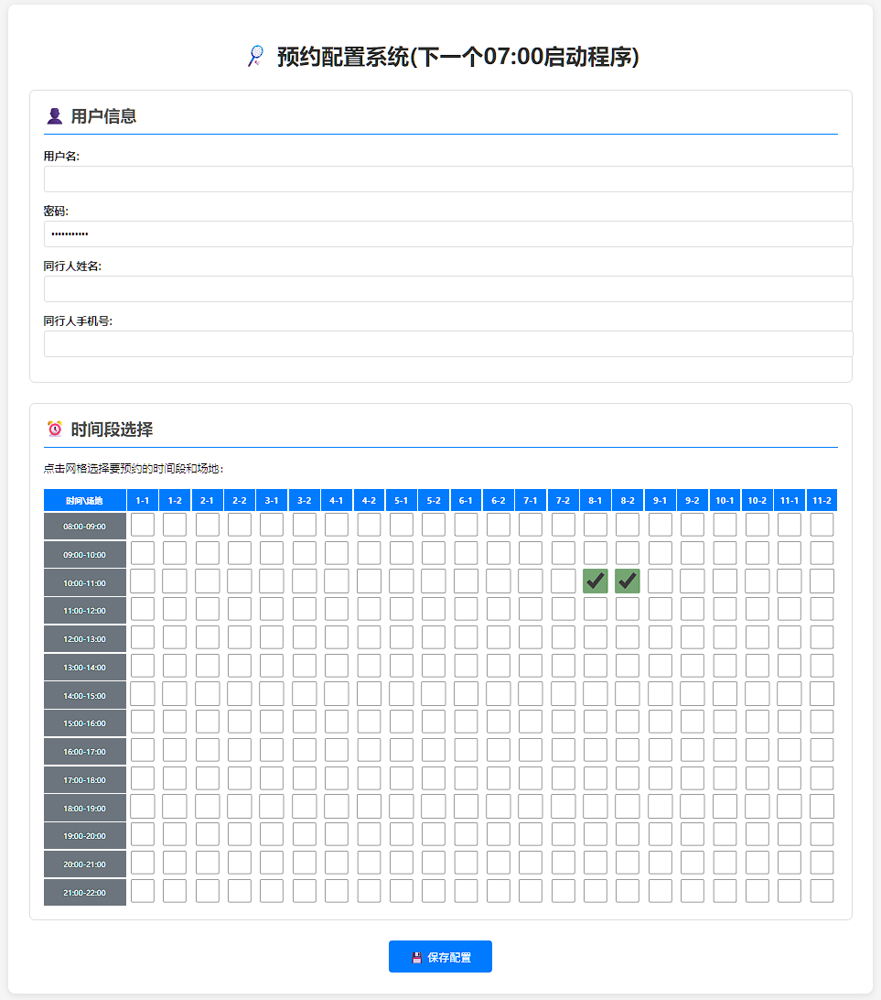

# 🏸 自动预约程序

一个基于 Playwright 的自动化羽毛球场地预约系统，支持 Web 界面配置和定时执行。

## ✨ 功能特性

- 🤖 **自动化预约**：使用 Playwright 自动登录并预约场地
- 🌐 **Web 配置界面**：友好的可视化配置界面，无需手动编辑配置文件
- ⏰ **定时执行**：支持每天定时自动执行预约任务
- 📊 **灵活配置**：支持多时间段、多场地的组合预约
- 🔄 **配置读取**：Web 界面自动读取现有配置，支持修改和更新

## 📁 项目结构

```
自动预约程序/
├── auto_reservation.py    # 核心预约逻辑
├── main.py               # 定时调度器
├── web_config.py         # Web 配置界面
├── templates/
│   └── config.html       # Web 界面模板
├── requirements.txt      # 依赖包列表
├── reservation.csv       # 预约配置文件
├── .env                  # 环境变量配置
└── README.md            # 项目说明文档
```

## 🚀 快速开始

### 1. 环境准备

确保已安装 Python 3.7+，然后安装依赖：

```bash
pip install -r requirements.txt
```

### 2. 安装浏览器

安装 Playwright 浏览器：

```bash
playwright install chromium
```

### 3. 配置预约信息

#### 方式一：使用 Web 界面（推荐）


1. 启动 Web 配置界面：
```bash
python web_config.py
```

2. 打开浏览器访问：http://127.0.0.1:5000

3. 填写用户信息：
   - 用户名
   - 密码
   - 同行人姓名
   - 同行人手机号

4. 在时间段网格中选择要预约的时间段和场地

5. 点击"保存配置"按钮

#### 方式二：手动配置文件

创建 `.env` 文件：
```env
LOGIN_USERNAME=你的用户名
PASSWORD=你的密码
COMPANION_NAME=同行人姓名
COMPANION_PHONE=同行人手机号
```

编辑 `reservation.csv` 文件，在对应的时间段和场地位置填入 `1` 表示要预约。

### 4. 运行程序

#### 立即执行预约
```bash
python main.py
```

#### 定时执行（每天 7:00:05 自动运行）
程序会自动进入定时模式，等待下一次的执行时间。

## 📋 配置说明

### 时间段配置

支持以下时间段：
- 08:00-09:00 到 22:00-23:00（共14个时间段，全时间段，但是22：00以后其实是没有灯，打不了的。）

### 场地配置

支持场地：
- 1-1 到 11-2（共22个半个场地）

### CSV 文件格式

```csv
时间段,1-1,1-2,2-1,2-2,...,11-1,11-2
08:00-09:00,0,1,0,0,...,0,0
09:00-10:00,1,0,1,0,...,0,1
...
```

- `1` 表示要预约该时间段的该场地
- `0` 表示不预约

## 🔧 核心模块

### AutoReservation 类

位于 `auto_reservation.py`，负责：
- 浏览器自动化操作
- 用户登录
- 场地选择和预约
- 错误处理

### ReservationScheduler 类

位于 `main.py`，负责：
- CSV 文件解析
- 定时任务调度
- 预约任务执行

### Web 配置界面

位于 `web_config.py`，提供：
- 用户友好的配置界面
- 自动读取现有配置
- 配置文件生成

## ⚠️ 注意事项

1. **网络环境**：确保网络连接稳定，能够访问预约网站
2. **时间同步**：建议保持系统时间准确，以确保定时执行的准确性
3. **浏览器版本**：Playwright 会自动管理浏览器版本，无需手动更新
4. **配置安全**：`.env` 文件包含敏感信息，请勿提交到版本控制系统

## 🐛 故障排除

### 常见问题

1. **登录失败**
   - 检查用户名和密码是否正确
   - 确认网站是否可正常访问

2. **元素定位失败**
   - 网站页面结构可能发生变化
   - 检查网络连接是否稳定

3. **预约失败**
   - 时间段可能已被其他用户预约
   - 检查选择的时间段是否在可预约范围内

### 调试模式

修改 `auto_reservation.py` 中的浏览器启动参数：
```python
self.browser = self.playwright.chromium.launch(headless=False, slow_mo=1000)
```

- `headless=False`：显示浏览器窗口
- `slow_mo=1000`：每个操作延迟1秒，便于观察

## 📄 许可证

本项目仅供学习和个人使用，请遵守相关网站的使用条款。

## 🤝 贡献

欢迎提交 Issue 和 Pull Request 来改进这个项目！

---

**免责声明**：本工具仅用于学习和研究目的，使用者需自行承担使用风险，并遵守相关法律法规和网站条款。